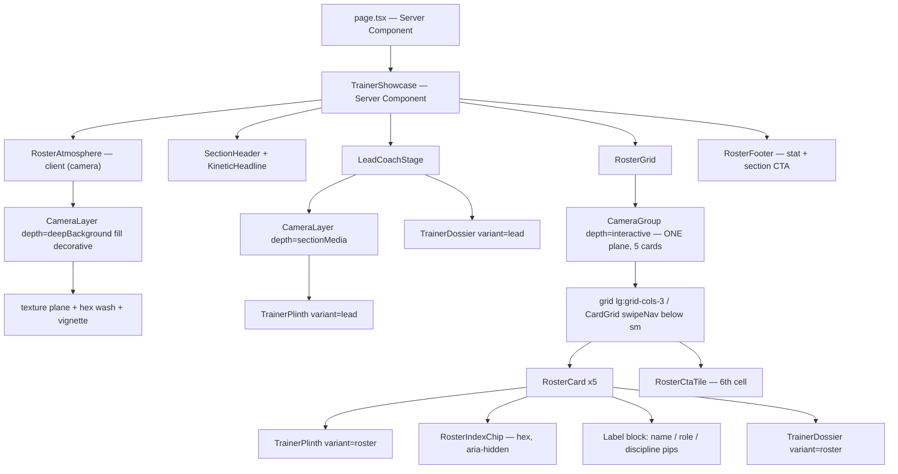
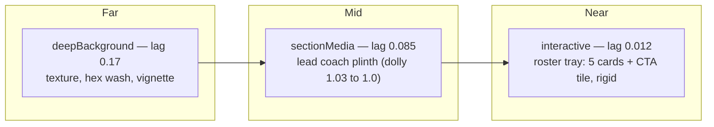
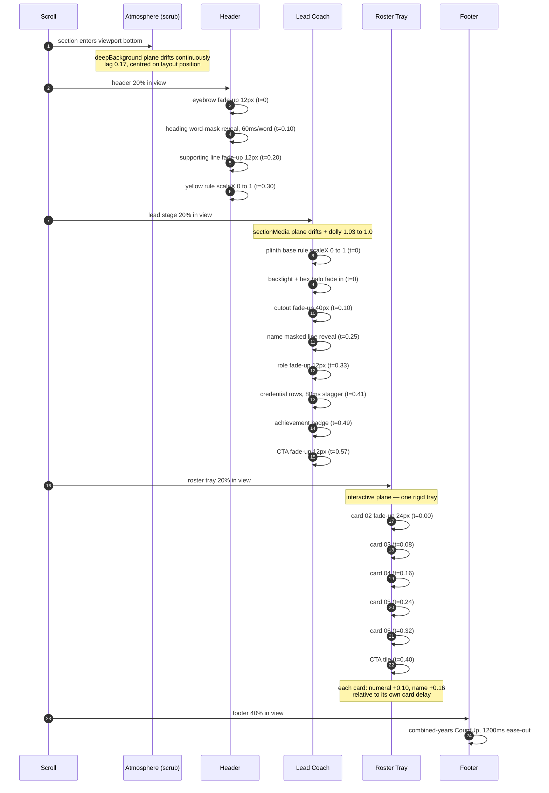
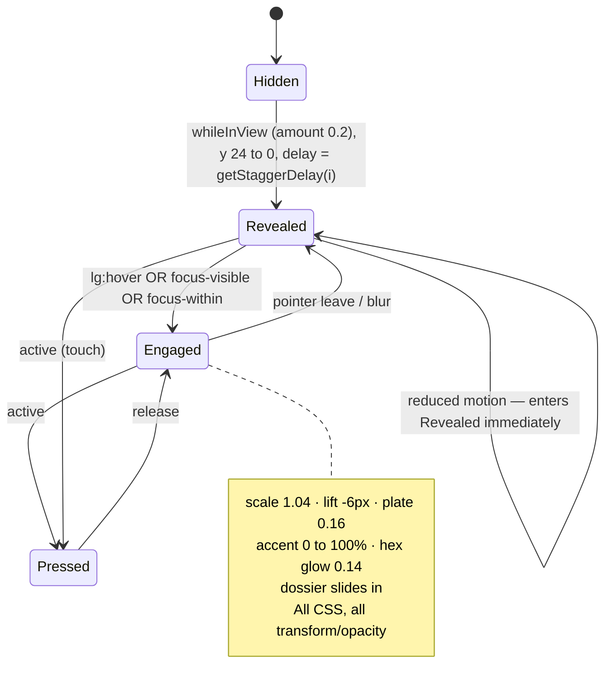

# Design Document: Train With Experts — Section Redesign

*Section under redesign: `src/components/sections/TrainerShowcase.tsx`, rendered on the homepage between `Facilities` and `Testimonials`. Eyebrow "Train With Experts", heading "Six trainers. Zero guesswork."*

*Reads against: [00-design-principles.md](../../../specifications/00-design-principles.md), [01-design-system.md](../../../specifications/01-design-system.md), [02-motion-system.md](../../../specifications/02-motion-system.md), [sections/trainershowcase-implementation-spec.md](../../../specifications/sections/trainershowcase-implementation-spec.md), [qa/motion-checklist.md](../../../specifications/qa/motion-checklist.md), `MOTION_SYSTEM_README.md`, `MOTION_DEPTH_IMPROVEMENTS.md`, `src/lib/motion/camera-tokens.ts`.*

---

## Overview

This redesign turns the trainer section from a wall of loose cutout PNGs into a **lit coaching floor**: one lead coach on a cinematic plinth with a full dossier, five coaches in a disciplined containment grid where every card carries the same frame, the same index numeral, the same credential stack and one controlled yellow accent, and a sixth grid cell that converts.

Two things drive every decision below:

1. **Depth parity.** The Hero, Programs and Facilities sections already establish a layered, camera-driven space with texture planes, index numerals, a hexagon shape language and yellow used as a spotlight. This section currently opts out of all of it. The fix is not new visual language — it is *carrying the existing language into this section at higher craft*.
2. **Containment.** Transparent PNG cutouts on flat near-black cannot read as designed. They need a surface to stand on, an edge to be framed by, and a label zone with a contrast floor. Every visual decision in §5 exists to stop the subjects floating.

Motion is scroll-choreographed but stays inside the project's existing systems — the shared virtual camera (`MotionCameraProvider` + `useCameraLayer`/`CameraLayer`/`CameraGroup`), `AnimationWrapper`, `AnimatedDivider`, `KineticHeadline`, `CountUp`. No new animation library, no new timing primitives, no bespoke `useScroll` per card.

---

## Problem Statement (current state)

| # | Problem | Root cause |
|---|---|---|
| P1 | Cutouts float with hard edges into the page background; no containment | No card frame, no plinth surface, no label zone — only a backlight and a contact shadow inside an unbordered aspect box |
| P2 | Name/role labels land in inconsistent positions relative to each subject | Labels sit *below* each frame in normal flow, so their distance from the subject's feet varies with how much empty headroom each PNG carries |
| P3 | Zero depth parity with the sections above | No texture plane, no hexagon motif, no index numerals, no rim/edge light, no camera-linked layers — the only depth cues are four static section-level gradients |
| P4 | All six trainers arrive at once; no hierarchy, no reveal, nothing that rewards scrolling | Single `AnimationWrapper` on the anchor + one stagger pass over five secondary blocks |
| P5 | Only Mohammed Wajeed has supporting copy and an achievement pill; the other five are name + title only | `Trainer` in `src/types/content.ts` has no fields for speciality, experience, certifications or philosophy |
| P6 | Motion is a fade/stagger and nothing else | Section is entrance-only; `02-motion-system.md` §4 explicitly withheld parallax because the section has no banner image |
| P7 | A full viewport of empty space around the lead trainer earns nothing | The `lg:w-[43%]` story stack holds four short lines against a 4:5 image |
| P8 | No conversion affordance anywhere in the section | Deliberate in v1 (`trainershowcase-implementation-spec.md` §16: "do not add a per-card link/CTA") |

P8 is the one problem whose current behaviour was a *documented decision*. The Spec Delta section records why this redesign overrides it and what replaces it.

---

## Design Goal and Success Criteria

Make this the most memorable section on the page while remaining unmistakably the same site.

| Criterion | Test |
|---|---|
| SC1 | A visitor can name what each coach specialises in without hovering or tapping |
| SC2 | Every cutout reads as standing on a surface inside a frame — no floating silhouettes at any breakpoint |
| SC3 | Every card's name/role/discipline sits in the identical position relative to its own frame |
| SC4 | The section carries at least three motifs shared with Hero/Programs: index numerals, hexagon shape, texture plane |
| SC5 | Scrolling reveals the section in a sequence a viewer can feel — header → lead coach → roster wave — not one simultaneous pop |
| SC6 | Exactly one yellow element per card, and one section-level action |
| SC7 | Under `prefers-reduced-motion` the section renders complete and static, with zero transform animation |
| SC8 | No Lighthouse regression: no layout shift from the section, no animated non-composited properties |
| SC9 | Keyboard-only users reach every coach and every revealed fact |

---

## Art Direction — Three Concepts

### Concept A — "Roster Rail" (pinned horizontal scrub)

The section pins for ~5 viewport heights; vertical scroll scrubs a horizontal rail of six coaches past a fixed stage while the active coach's dossier cross-fades beside them.

**Strengths.** Highest theatrical ceiling. Naturally solves P4 (progressive disclosure) and P7 (the empty space becomes travel).

**Why it loses.**
- It scroll-jacks. The whole page is built on one shared camera whose contract is *"y is a pure function of scroll position"* (`use-camera-layer.ts`) — nothing pins, nothing hijacks, scrolling up retraces the identical curve. A pinned section is a different physics model bolted onto that page.
- It out-animates Tier 3. `02-motion-system.md` §2 assigns TrainerShowcase to **Tier 2 — Building**, with a hard rule of *one* added depth cue, and reserves the page's peak choreography for Testimonials, which sits immediately after this section. A pinned rail would make Testimonials read as a let-down.
- It breaks the blend hand-offs. Pinning requires a tall spacer whose top and bottom are no longer the section's visual top and bottom, so the Facilities→dark and dark→Testimonials dissolves lose their anchors.
- Mobile needs a completely different implementation anyway (pinning under one-handed scroll reads as broken, not premium), so we would be maintaining two layouts with two motion models.

### Concept B — "The Lit Plinth" (featured lead + contained roster) ✅ RECOMMENDED

One lead coach on a cinematic lit plinth with a full dossier stack, then five coaches in a 3-column containment grid — identical frame, identical label zone, index numerals 02–06, hex index chip, hover/focus dossier layer — and a sixth cell that is a hex-motif booking tile.

**Strengths.**
- Every problem P1–P8 is addressed by a *containment and content* fix rather than a motion trick, so the section still reads as designed on a low-end phone with reduced motion on.
- It stays Tier 2: its one added depth cue is the camera's `sectionMedia`/`interactive` planes plus a `deepBackground` texture plane — the same technique Programs already uses, not a new one.
- The 3×2 grid gives the roster the "lineup" metaphor `trainershowcase-implementation-spec.md` §3 asked for, and the 6th cell (CTA tile) makes the grid resolve instead of leaving a hole.
- It preserves both blend hand-offs untouched, because the section's box geometry does not change.
- Mobile is the existing `CardGrid swipeNav` swipe strip with `StripNavigator` — a pattern already shipping in Programs, complete with hex steppers and an index readout, so mobile gets index parity for free.

**Costs.** Least "novel" of the three on paper. The craft has to come from the plinth lighting, the label discipline and the choreography — which is exactly where a designer pitching to an owner should be spending it.

### Concept C — "Stacked Dossier" (alternating full-bleed rows)

Six full-bleed rows, image alternating left/right, oversized index numeral, name as display type, credential grid beside it, each row scroll-revealed.

**Strengths.** The most editorial and the most credential-forward. Perfect desktop→mobile parity (rows just stack).

**Why it loses.** Six full-bleed rows is roughly 4–5 viewports of section — it re-commits P7 six times over and buries the Testimonials peak far below the fold. It also flattens hierarchy: six equal rows says "directory", and the roster's one genuinely sellable fact ("Mr Nizamabad") loses its spike. Worth keeping in the back pocket for a future dedicated `/trainers` page, where length is an asset.

### Recommendation

**Concept B, "The Lit Plinth."** It is the only option that raises craft without breaking the page's motion physics, its tier discipline, or its section blending — and it is the only one where the *content* upgrade (P5) carries as much of the pitch as the motion does. A gym owner's objection will never be "not enough parallax"; it will be "you didn't show what my coaches can do." B fixes that first, then makes it move.

---

## Visual Language Specification

### 5.1 Plinth anatomy (the containment fix for P1)

Every coach — lead and roster — is composed from one shared frame, `TrainerPlinth`. Phase 5's hard-won compositing lesson is preserved verbatim: **an outer wrapper that never clips** (so the backlight can bleed and fade in open space) and **an inner `overflow-hidden` frame** (so oversized numerals can never cause overflow).

Paint order, bottom → top:

| z | Layer | Treatment | Animated? |
|---|---|---|---|
| — | Outer wrapper (`relative`, no clip) | Backlight radial, `-inset-4 lg:-inset-6`, peak ≤13% white (roster) / ≤11% brand-yellow (lead), 3-stop falloff | Opacity on reveal only |
| 0 | Plinth surface | `linear-gradient(180deg, rgba(255,255,255,0.055) 0%, rgba(255,255,255,0.015) 45%, transparent 72%)` — a lit vertical face, not a card fill | No |
| 0 | Frame edge light | 1px hairline: `border-t border-l border-white/10`, plus a `via-white/22` vertical hairline on the light side | No |
| 1 | Texture plane | `luxury-grid-pattern.webp` (existing Programs asset), `opacity 0.06`, `repeat-y`, edge-faded by a vertical mask | No (section-level plane drifts via camera) |
| 5 | Backdrop plate | `public/back/{slug}.jpg`, `object-cover`, static `grayscale` + `brightness-75`, opacity `0 → 0.16` on hover/focus-visible. Wrapped in `hidden lg:block` — `display: none` below `lg:`, which is the only hiding mechanism that also suppresses the lazy fetch | Opacity only |
| 6 | Grounding | Contact-shadow radial (`ellipse, rgba(0,0,0,0.35) 0%, transparent 65%`, 70% × 12%, bottom-centred) + floor-light radial (`ellipse 55% 40% at 50% 92%`, `rgba(255,255,255,0.06)`) — Phase 5 geometry, unchanged | No |
| 10 | Cutout | `next/image` `fill`, `object-cover object-bottom`, `transform-origin: bottom center` | `scale` on hover |
| 20 | Label pool | `linear-gradient(0deg, rgba(20,24,29,0.92) 0%, rgba(20,24,29,0.72) 45%, transparent 100%)` over the bottom 38% of the frame | No |
| 30 | Hex index chip | Flat-top hexagon, 36px (`lg:40px`), `bg-white/10` rim + `bg-ink` core, numeral in `font-display` white/70 | Masked reveal |
| 30 | Label block | Name / role / discipline pips, pinned to the frame's bottom padding | Masked reveal + accent draw |
| 40 | Dossier layer (roster only) | Philosophy line + "Book a session" affordance, `opacity 0 → 1` + `translateY 12px → 0` on `lg:group-hover` / `group-focus-within`. Always visible below `lg:` | Opacity + transform |

**On rim light, honestly:** a true silhouette-following rim light on a transparent PNG requires either a pre-baked rim-lit asset or an SVG/`drop-shadow` filter pass. Animated filters are banned by `MOTION_SYSTEM_README.md` §3, and a static `drop-shadow` on six large cutouts costs a paint the compositor cannot skip. So the design simulates it with the **frame edge light + strengthened backlight + floor light**, which is what actually sells "standing in a lit studio." If the owner wants literal rim light, that is an *asset* dependency (see Dependencies), not a CSS one.

### 5.2 Label discipline (the fix for P2)

The single most important geometric change: **labels move inside the frame**, pinned to the frame's own bottom edge over the ink pool.

- Consequence: the name/role position is now measured from the frame, not from the subject's feet — so it is pixel-identical across all six coaches regardless of PNG headroom.
- Contrast floor: white text over `rgba(20,24,29,0.92)` composited on the section's Ink background yields ≥ 15:1. Discipline pips use `text-white/70` over the same pool (≥ 9:1). Both clear WCAG AA for their sizes with margin.
- The lead coach is the one exception: its dossier sits in a column beside the frame (§5.5), because a lead needs more copy than any label pool should hold.

### 5.3 Index numerals (motif carried from Programs)

Programs renders `01`–`09` as `font-display text-4xl lg:text-5xl text-white/35` with a 1px white stroke in the top-right of each card, `aria-hidden`. This section carries that treatment forward with one addition: **the numeral sits inside a flat-top hexagon chip**, which is how the shape motif enters the section without inventing decoration.

- Order: lead is `01`; roster is `02`–`06` in presentation order.
- Format: `String(n).padStart(2, "0")` — the same helper shape used today.
- Always `aria-hidden="true"`. Identity is carried by the real `<h3>` name, never by a numeral.
- The oversized backdrop numeral behind each cutout (current Phase 4 device) is **retired**. It was solving "this frame needs graphic interest" — a problem the plinth surface, texture plane and hex chip now solve with better hierarchy. Keeping both would put two numerals per card on screen.

### 5.4 Hexagon motif

Reuses the exact clip already shipping in `SceneNavigator` and `StripNavigator`:

```ts
const HEX_CLIP = "polygon(25% 0%, 75% 0%, 100% 50%, 75% 100%, 25% 100%, 0% 50%)";
```

It is currently **duplicated in two files**. This design extracts it once to `src/lib/shapes.ts` and has all call sites import it — a prerequisite refactor, not new surface area.

Applications, in order of prominence:
1. **Hex index chip** on every card (rim + core, matching `StripNavigator`'s machined-steel construction).
2. **Hex halo** behind the lead coach's head/shoulder — a hex-clipped brand-yellow radial at ≤7% opacity, `aria-hidden`, sized so its flats echo the chip's.
3. **Discipline pips** — 8px hex dots preceding each speciality tag.
4. **CTA tile** — hex-clipped icon plate.

### 5.5 Typographic hierarchy

No new type tokens. Everything maps to existing `@theme` values in `globals.css`.

| Role | Token / classes | Notes |
|---|---|---|
| Section heading | `Heading level="section"` via `KineticHeadline` | Same treatment Programs' heading already uses |
| Lead coach name | `Heading level="section" as="h3"` + `tracking-tight` | Display weight, the largest name in the section |
| Roster coach name | `Heading level="subsection" as="h3"` + `tracking-tight` | Bold body face, consistent baseline across all five |
| Role / title | `text-xs font-medium uppercase tracking-widest text-zinc-400` | Tracked micro-caps, unchanged from current implementation |
| Discipline tag | `text-caption font-semibold uppercase tracking-[0.14em] text-white/70` | Tracked small caps |
| Credential value (years, certs) | `text-caption font-semibold tabular-nums tracking-[0.08em]` | **No mono face exists** in the two-family system (`Archivo Black` + `Inter`). Numeric alignment comes from `tabular-nums`, not from importing a third family — that would violate the two-font rule in `01-design-system.md` §3 |
| Achievement pill | `Badge variant="achievement"` | Existing ink-chip + yellow-text variant |
| Philosophy line | `BodyText size="standard" text-text-secondary-dark`, `max-w-[26ch]` | |

Baseline consistency rule: within the roster, the label block is bottom-pinned with a fixed padding (`p-4 lg:p-5`) and a fixed internal rhythm (`gap-1` name→role, `gap-2` role→pips), so all five names sit on the same baseline offset from their frame's bottom edge.

### 5.6 Accent discipline

**One yellow element per card, maximum.**

| Surface | Its one yellow | At rest? |
|---|---|---|
| Section header | Eyebrow ("Train With Experts") | Yes |
| Lead coach | `Badge variant="achievement"` ("Mr Nizamabad") + the existing 12/16px yellow rule under it, treated as one accent group | Yes |
| Roster card | Name underline (`bg-brand-yellow`, 2px, 0%→100% width) | **No — appears on hover/focus only** |
| CTA tile | Primary button | Yes |

**The roster achievement badge spends no yellow.** `Badge variant="achievement"` is ink with yellow text, so using it on a roster card would break the resting-zero rule above the moment a second coach earns an achievement. The roster variant therefore renders the badge as `Badge variant="informational"` (`bg-ink text-white`, already in the component), and yellow achievement styling stays exclusive to the lead's accent group. No new variant is added — the trade is a variant choice, not new surface area.

Rationale: three resting yellow points (eyebrow, lead badge, CTA tile) form a clean triangle down the section. Putting yellow on all five roster cards at rest would turn the spotlight into wallpaper, which `globals.css` names as the brand's own rule ("spotlight, not wallpaper").

### 5.7 Background continuity (blends preserved)

The section's box geometry, tone and both dissolve layers are **unchanged**:

- Top blend: `linear-gradient(180deg, rgba(20,24,29,0.4) → transparent)`, `h-20 sm:h-24 lg:h-32`, receiving Facilities' light→dark hand-off (`Facilities` is `tone="light"` and paints a matching `rgba(20,24,29,0.18)` bottom blend).
- Bottom blend: `linear-gradient(0deg, rgba(20,24,29,0.35) → transparent)`, receiving into Testimonials' `tone="light"` top blend (`rgba(20,24,29,0.35) → transparent`).
- The existing warm radial wash and section vignette stay; the new texture plane is added *between* them, at `opacity 0.06`, masked so it never reaches either blend zone.

Hard constraint: **no new layer may paint within the top or bottom 128px of the section**, which is where both hand-offs live.

---

## Architecture

*High-level design: component structure, the Server/Client boundary, depth planes, layout geometry.*

### 6.1 Component structure



### 6.2 Server / Client boundary

This is the part most likely to be got wrong, so it is specified explicitly.

| Piece | Directive | Why |
|---|---|---|
| `TrainerShowcase` | **Server** (unchanged) | Reads `trainers` at build time, maps content → JSX. Keeping it server-side is what keeps the homepage's hydration budget flat |
| `RosterAtmosphere` | **Client** | Composes `CameraLayer`, which calls `useCameraLayer` → `useScroll` |
| `LeadCoachStage` | **Server**, wrapping client `CameraLayer` | The stage is layout; only the camera wrapper inside it is client |
| `RosterGrid` | **Server**, wrapping client `CameraGroup` / `CardGrid` | Same pattern Programs already uses |
| `TrainerPlinth` | **No directive** — renders in whichever tree imports it | Pure presentational. All interaction is CSS (`group-hover`, `group-focus-visible`, `group-focus-within`), so it needs **zero** hydration |
| `RosterCard` | **No directive** | Same: hover/focus craft is CSS-only. The card's *reveal* comes from the `AnimationWrapper` (client) that wraps it |
| `TrainerDossier`, `RosterIndexChip`, `RosterCtaTile` | **No directive** | Pure presentational |
| `MaskedLine` (name reveal) | **Client** | Uses `useReducedMotion` + `whileInView` |
| `KineticHeadline` | **Client** (existing) | Needs a small extension — see §13.4 |

**Decision worth calling out:** the hover dossier is deliberately **CSS-driven, not state-driven**. A `useState`-based hover would force `RosterCard` to `"use client"` and ship five hydrated card trees for an effect Tailwind's `group-hover:` / `group-focus-within:` variants already express. This is also why the dossier reveals on `focus-within` for free — keyboard parity falls out of the same mechanism instead of needing a second code path.

**Data crossing the boundary:** `Trainer` objects are plain JSON-serialisable data (strings, numbers, string arrays) — safe to pass into client components. No functions, no `Date`, no class instances. `CardGrid`'s existing doc comment records the same rule and the reason: function props cannot cross the Server→Client boundary, so `TrainerShowcase` maps its own array into JSX and passes rendered children in.

### 6.3 Depth planes

The section subscribes to the shared camera **three times, not eight**. `camera-tokens.ts` is explicit that per-card cameras were the previous mistake: nine subscriptions differing by fractions of a pixel, producing no perceptible depth. Cards ride one tray.



| Plane | Depth token | Subscriptions | Overscan | Notes |
|---|---|---|---|---|
| Atmosphere | `deepBackground` (lag 0.17) | 1 | Yes (system-owned) | `fill decorative` — `aria-hidden` + `pointer-events-none` handled by `CameraLayer` |
| Lead plinth | `sectionMedia` (lag 0.085, dolly 1.03→1.0) | 1 | Yes | The section's one Tier-2 depth cue on real content |
| Roster tray | `interactive` (lag 0.012) | 1 | No | One `CameraGroup` around the whole grid; cards never move relative to each other |

Per-card differentiation belongs to hover, on a different property, with a different owner — exactly as `camera-tokens.ts` prescribes.

### 6.4 Layout geometry

**Desktop (≥1024px)**

```
┌──────────────────────────────────────────────────────────────┐
│ eyebrow / heading                        supporting line →   │
│ ──── yellow rule                                             │
├─────────────────────┬─────────────────────┐  ← spread capped 980px
│  01 LEAD PLINTH     │  DOSSIER (52%)      │     items-center
│  (48%) aspect-[4/5] │  name (display)     │
│  447 × 559px @ lg   │  role (micro-caps)  │
│  hex halo behind    │  ── yellow rule     │
│  shoulder           │  discipline pips    │
│  label pool: name   │  years · certs      │
│  suppressed         │  achievement badge  │
│  (dossier owns      │  philosophy line    │
│   identity)         │  → Book with coach  │
├───────────────┬───────────────┬───────────────┬──────────────┤
│  02           │  03           │  04           │              │  ← grid-cols-3
├───────────────┼───────────────┼───────────────┤              │
│  05           │  06           │  CTA TILE     │              │
└───────────────┴───────────────┴───────────────┴──────────────┘
│ 6 coaches · N years on the floor between them   → See all →  │
└──────────────────────────────────────────────────────────────┘
```

The lead's identity lives in the dossier column, so its plinth's label pool renders the role only (or nothing) — one name per person, never two.

**Roster cell:** uniform `aspect-[4/5]`, uniform frame, uniform label pool. Ruma Mehar's near-square source (1162×1240 ≈ 0.94) is cropped ~15% horizontally by `object-cover object-bottom` into 4:5 — acceptable because her subject is centred. **Containment discipline beats per-photo aspect variation**: the ragged accidental grid (P2) is exactly what per-photo aspect ratios produced.

---

## Data Models

### 7.1 Extended `Trainer` type

Extends `src/types/content.ts`. Every new field is **optional** except `discipline`, so the section degrades gracefully while the gym owner supplies real facts.

```ts
/** One label/value credential row in a coach's dossier. */
export interface TrainerCredential {
  /** Tracked micro-caps label, e.g. "Certification", "Experience". */
  label: string;
  /** The fact itself, e.g. "ACE CPT", "9 years". */
  value: string;
}

export interface Trainer {
  // ── existing, unchanged ────────────────────────────────────────────
  slug: string;
  name: string;
  title: string;
  /** Retained for back-compat. Prefer `signatureAchievement`. */
  achievementBadge?: string;
  imageSrc: string;
  imageAlt: string;

  // ── new ───────────────────────────────────────────────────────────
  /** 1–3 speciality tags rendered as hex-pipped micro-caps. REQUIRED:
   *  every coach must be answerable to "what do they actually coach?".
   *  Derived from each coach's existing `title` when nothing richer is
   *  supplied — never invented. */
  discipline: string[];

  /** Whole years on the floor. Renders a credential row + feeds the
   *  section's combined-years CountUp. Omit rather than estimate. */
  yearsExperience?: number;

  /** Named certifications, verbatim. Rendered as credential rows. */
  certifications?: string[];

  /** The one most sellable fact about this coach, e.g. "Mr Nizamabad".
   *  Rendered via <Badge variant="achievement">. */
  signatureAchievement?: string;

  /** One line, first person or declarative, ≤ 90 chars. The dossier's
   *  human beat. */
  philosophy?: string;

  /** Backdrop depth plate — public/back/{slug}.jpg. Revealed at 16%
   *  opacity on hover/focus, desktop only. */
  backdropSrc?: string;

  /** Per-coach CTA target. Falls back to the section-level booking
   *  target when absent. */
  ctaHref?: string;

  /** Exactly one trainer in the array may set this. Drives lead
   *  selection instead of relying on array position. */
  lead?: boolean;
}
```

### 7.2 Content honesty contract

**Nothing in `src/content/trainers.ts` may be fabricated.** `trainershowcase-implementation-spec.md` §16 already states this rule for badges; it now applies to every new field. Practical consequences:

- `discipline` for all six can be derived from existing titles today (e.g. "Nutritionist & Fitness Trainer" → `["Nutrition", "Personal Training"]`). Derivation is a rewording of an existing fact, which is allowed.
- `yearsExperience`, `certifications`, `philosophy`, and any achievement beyond Wajeed's "Mr Nizamabad" **must come from the owner**. Until they do, those fields stay absent and the dossier renders shorter. This is tracked under Open Questions.
- The section's combined-years `CountUp` renders **only if every coach has `yearsExperience`**. A partial sum would be a wrong number presented as a fact. See §13.5's `resolveCombinedYears`.

### 7.3 Degradation matrix

The roster card must never look broken or half-filled, whatever subset of optional fields is present.

| Fields present | Card renders | Layout effect |
|---|---|---|
| name + title + discipline (minimum) | Label pool: name, role, up to 2 pips. Dossier layer: CTA affordance only | Label pool height unchanged (fixed padding + fixed rhythm) |
| + `yearsExperience` | Adds a `9 YRS` credential chip beside the hex index | No reflow — chip occupies a reserved slot |
| + `signatureAchievement` | Achievement badge replaces the second discipline pip row — `variant="achievement"` on the lead, `variant="informational"` on the roster (§5.6) | Pips truncate to 1; badge is the higher-value fact; roster accent budget unchanged |
| + `philosophy` | Dossier layer gains the philosophy line above the CTA | Dossier is an overlay; growth does not move the card |
| + `certifications` | Roster: first cert only, appended to the credential chip. Lead: all, as credential rows | Roster caps at one to protect the label pool's fixed height |
| `backdropSrc` absent | Hover reveals plinth surface + texture only | Interaction still perceptible via scale + lift + accent draw |

**Invariant:** the label pool's rendered height is identical for all five roster cards at a given breakpoint, regardless of which optional fields exist. Anything variable-length lives in the overlay dossier, never in the pool.

---

## Motion and Scroll Choreography

### 8.1 Rules this choreography obeys

1. **Closed vocabulary.** `02-motion-system.md` §1: durations, easings, distances and stagger values are closed. Everything below is `0.5s` / `0.18s` / `1.2s`, easing `[0.16, 1, 0.3, 1]`, distances `12 / 24 / 40 / 48px`, stagger `0.08s` capped at 6 items.
2. **Existing primitives only.** `AnimationWrapper`, `AnimatedDivider`, `CountUp`, `KineticHeadline`, `CameraLayer` / `CameraGroup`. One extension is needed (`KineticHeadline trigger`), specified in §13.4. Nothing else is new.
3. **Tier 2 cap.** One added depth cue: the camera planes. The section must not out-choreograph Testimonials (Tier 3) immediately below it.
4. **Transform and opacity only.** No animated `clip-path`, no `filter`, no `box-shadow`, no `width`/`height`. Masked line reveals use `overflow-hidden` + `translateY`, which is what `KineticHeadline` already does — this is deliberately chosen *over* the clip-path reveal the brief suggested, because `translateY` is guaranteed compositor-only while `clip-path` interpolation is not.
5. **Scrub vs one-shot.** Continuous scroll response comes **only** from camera planes (3 subscriptions, §6.3). Everything else is one-shot `whileInView` at `amount: 0.2`. No component hand-rolls `useScroll`.

### 8.2 Choreography timeline



### 8.3 Checkpoint values

`E` = `[0.16, 1, 0.3, 1]` (`MOTION_EASING`). All delays are seconds, relative to that group's own viewport trigger.

| # | Element | Mechanism | Transform | Duration | Delay | Trigger |
|---|---|---|---|---|---|---|
| 1 | Atmosphere plane | `CameraLayer depth="deepBackground" fill decorative` | `y = (p−0.5)·A`, A derived from lag 0.17 | continuous | — | scrub |
| 2 | Lead plinth plane | `CameraLayer depth="sectionMedia"` | `y` + dolly `scale 1.03→1.0` | continuous | — | scrub |
| 3 | Roster tray plane | `CameraGroup depth="interactive"` | `y`, lag 0.012 | continuous | — | scrub |
| 4 | Eyebrow | `AnimationWrapper preset="small"` | `y 12→0`, `opacity 0→1` | 0.5 | 0 | `whileInView` 0.2 |
| 5 | Heading | `KineticHeadline trigger="inView"` | per word `y 110%→0` inside mask | 0.5 | 0.10 + 0.06·i | `whileInView` 0.2 |
| 6 | Supporting line | `AnimationWrapper preset="small"` | `y 12→0` | 0.5 | 0.20 | `whileInView` 0.2 |
| 7 | Header rule | `AnimatedDivider orientation="horizontal"` | `scaleX 0→1` | 0.5 | 0.30 | `whileInView` 0.2 |
| 8 | Lead plinth base rule | `AnimatedDivider orientation="horizontal"` | `scaleX 0→1` | 0.5 | 0 | `whileInView` 0.2 |
| 9 | Lead backlight + hex halo | `AnimationWrapper variant="fade"` | `opacity 0→1` | 0.5 | 0 | `whileInView` 0.2 |
| 10 | Lead cutout | `AnimationWrapper preset="large"` | `y 40→0` | 0.5 | 0.10 | `whileInView` 0.2 |
| 11 | Lead name | `MaskedLine` | `y 110%→0` in `overflow-hidden` | 0.5 | 0.25 | `whileInView` 0.2 |
| 12 | Lead role | `AnimationWrapper preset="small"` | `y 12→0` | 0.5 | 0.33 | `whileInView` 0.2 |
| 13 | Credential rows (i) | `AnimationWrapper preset="small"` | `y 12→0` | 0.5 | `0.41 + getStaggerDelay(i)` | `whileInView` 0.2 |
| 14 | Achievement badge | `AnimationWrapper preset="small"` | `y 12→0` | 0.5 | 0.49 | `whileInView` 0.2 |
| 15 | Lead CTA | `AnimationWrapper preset="small"` | `y 12→0` | 0.5 | 0.57 | `whileInView` 0.2 |
| 16 | Roster card (i = 0..4) | `AnimationWrapper preset="medium"` | `y 24→0` | 0.5 | `getStaggerDelay(i)` → 0 / .08 / .16 / .24 / .32 | `whileInView` 0.2 |
| 17 | Card index numeral | `MaskedLine` | `y 110%→0` | 0.5 | card delay + 0.10 | inherits card trigger |
| 18 | Card name | `MaskedLine` | `y 110%→0` | 0.5 | card delay + 0.16 | inherits card trigger |
| 19 | CTA tile | `AnimationWrapper preset="medium"` | `y 24→0` | 0.5 | `getStaggerDelay(5)` = 0.40 | `whileInView` 0.2 |
| 20 | Combined-years counter | `CountUp` | numeric, ease-out cubic | 1.2 | 0 | `useInView` 0.4 |

**Stagger cap check:** the roster's six revealing items (5 cards + CTA tile) land at 0 → 0.40, inside the 0.48 / 6-item cap from `02-motion-system.md` §1. Nothing exceeds it, so no compression is needed.

**Continuous-sequence check:** the roster is one stagger sequence across both grid rows (indices 0–5), not two sequences that reset — the exact defect the motion QA checklist flags for Programs and Testimonials.

### 8.4 Micro-interactions

Desktop pointer only (`lg:` prefixed), each with a keyboard-equivalent trigger. All are CSS transitions on `transform` / `opacity`, gated by `motion-safe:`.

| Interaction | Property | From → To | Duration | Trigger |
|---|---|---|---|---|
| Subject scale | `transform: scale`, `transform-origin: bottom center` | `1 → 1.04` (`scalePresets.medium`) | 500ms | `lg:group-hover`, `group-focus-visible` |
| Plinth lift | `transform: translateY` | `0 → -6px` | 500ms | same |
| Backdrop plate reveal | `opacity` | `0 → 0.16` | 500ms | same |
| Accent line draw | `background-size` on the name underline | `0% 2px → 100% 2px` | 400ms in / 300ms out | same |
| Hex chip glow | `opacity` of a hex-clipped brand-yellow layer | `0 → 0.14` | 500ms | same |
| Dossier slide-in | `opacity` + `translateY` | `0 → 1`, `12px → 0` | 500ms | `lg:group-hover`, `group-focus-within` |
| Card press | `transform: scale` | `1 → 0.98` | 180ms | `active:` (touch + pointer) |
| Focus ring | `outline` | 2px `brand-yellow`, 2px offset | none | `:focus-visible` |

**Cursor-adjacent effects: deliberately none.** `MagneticButton` exists and is reserved for buttons; adding cursor-following to five image cards would put a second, competing motion model inside a Tier 2 section — and `ProgramCard`'s own doc comment records the same rejection ("no pointer tracking — the plane itself never moves"). The section's craft budget is spent on the plinth lighting and the scroll sequence instead.

`transform-origin: bottom center` on the subject scale is load-bearing: a centre-origin scale would lift the coach's feet off the plinth on hover, undoing the grounding work in §5.1.

### 8.5 Reduced-motion parity

`prefers-reduced-motion: reduce` is handled at three levels, all pre-existing: `MotionCameraProvider` sets `intensity = 0` (every camera plane resolves to a zero transform with layout untouched), each motion primitive has its own `useReducedMotion` bypass, and `globals.css` carries a defence-in-depth block.

| Animation | Reduced-motion behaviour |
|---|---|
| All three camera planes | `intensity = 0` → `y = 0`, no dolly, no `will-change`, no overscan. Layout identical |
| Every `AnimationWrapper` reveal | Renders a plain `div` in final state, no delay |
| `KineticHeadline` / `MaskedLine` | Plain text node, fully visible, no mask wrapper |
| `AnimatedDivider` rules | Final rule rendered immediately |
| `CountUp` | Final number rendered immediately (already `sr-only`-backed) |
| Subject scale / plinth lift / dossier slide / hex glow / accent draw | `motion-safe:` gating means the transition never applies; the **final state is still reachable** on hover/focus — it just arrives instantly. Content availability never depends on animation |
| Card press | No scale |

**SC7 test:** with the flag on, every one of the six coaches' name, role, discipline, credentials and CTA must be readable without any interaction, and no element may report a non-identity transform.

### 8.6 Motion budget

| Budget | Limit | This design |
|---|---|---|
| Camera subscriptions (scroll listeners) | ≤ 4 per section | 3 |
| `useScroll` calls outside the camera system | 0 | 0 |
| Infinite/looping animations | 0 (Hero's scroll cue is the one sitewide exception) | 0 |
| Animated non-composited properties | 0 | 0 |
| Elements with permanent `will-change` | overscan planes only, system-owned | 2 (atmosphere, lead plinth) |
| Hydrated client components added | as few as possible | 3 (`RosterAtmosphere`, `MaskedLine`, extended `KineticHeadline`) — cards stay unhydrated |

---

## Responsive Behaviour

| | Mobile (<640px) | Tablet (640–1023px) | Desktop (≥1024px) |
|---|---|---|---|
| Header | Stacked, left-aligned. Supporting line below heading | Stacked, centred per `SectionHeader` defaults | Heading left, supporting line right-aligned above the lead |
| Lead coach | Full-width plinth, dossier stacked below | Full-width plinth, dossier stacked below | 48 / 52 two-column spread, capped at 980px, `items-center`. Plinth 447 × 559px at ≥1124px |
| Lead numeral chip | 32px hex | 36px hex | 40px hex |
| Roster role line | Two-line fixed box (`line-clamp-2 h-8`) | Two-line fixed box | Two-line fixed box — replaces the single-line `truncate` that ellipsised three of five titles at ~400px card width |
| Roster pips | One hex dot, disciplines joined with `·` | Same | Same — replaces one dot per discipline, which truncated both labels in a 3-column cell |
| Roster | `CardGrid swipeNav` snap strip, 85% card width, `StripNavigator` below (index readout + segmented rail + hex steppers) | `grid-cols-2`, 3 rows (02·03 / 04·05 / 06·CTA) | `grid-cols-3`, 2 rows (02·03·04 / 05·06·CTA) |
| Dossier layer | **Always visible** — no hover exists | **Always visible** — hover is unreliable on hybrid/touch tablets | Hover / focus-within reveal |
| Backdrop plate | Not rendered | Not rendered | Rendered, lazy |
| Texture plane | Rendered, opacity 0.045 | Rendered, opacity 0.055 | Rendered, opacity 0.06 |
| Camera intensity | 0.45 (system) | 0.7 (system) | 1.0 (system) |
| CTA tile | Last cell of the swipe strip | 6th cell | 6th cell |

**Why the mobile roster is a swipe strip, not a pinned rail:** it is the pattern already shipping in Programs (`CardGrid swipeNav` + `StripNavigator`), it is native scroll (no scroll-jacking, no touch-event interception, no `overscroll` fight with browser back-swipe), and `StripNavigator` already gives mobile the index parity the desktop hex chips provide. Pinning on mobile is the known UX hazard the brief flags; this design does not pin at any breakpoint, so no pinned fallback is needed.

**No horizontal overflow, guaranteed by:** oversized graphics living inside `overflow-hidden` frames; the backlight bleeding only on the vertical/horizontal insets of a `relative` wrapper inside a `Container`-constrained column; the swipe strip's own `overscroll-x-contain`; no negative horizontal margins anywhere in the section.

---

## Accessibility

| Concern | Decision |
|---|---|
| Roster semantics | The roster is a real list: `<ul>` with one `<li>` per coach. The lead coach sits outside the list as its own `<article>`, because it is a featured spread rather than a list peer |
| Heading hierarchy | Section `<h2>` (from `SectionHeader`), each coach name `<h3>`. Visual weight (`level="section"` for the lead, `level="subsection"` for the roster) stays decoupled from semantics via `Heading`'s `as` prop |
| One name per person | The name is rendered exactly once per coach in the accessibility tree. Numerals are `aria-hidden`; the lead's plinth label pool does not repeat the dossier's name |
| Accessible names on links | Per-coach CTA: `aria-label={\`Book a session with ${name}, ${title}\`}`. Never a bare "Book" |
| Keyboard reachability | Each roster card's CTA is a real `<a>`. The dossier reveals on `group-focus-within`, so tabbing into a card exposes the same content hover does |
| Focus visible | 2px `brand-yellow` outline at 2px offset on the card's link, plus the card's own lift/accent states fire on `group-focus-visible` — focus gets full parity with hover, not a bare ring |
| Hover-gated content | Identity and credentials (name, role, discipline, years) are **never** hover-gated — they live in the always-visible label pool. Only the philosophy line and CTA label are reveal-on-interaction, and they are always visible below `lg:` |
| Decorative layers | Every atmosphere, backlight, texture, grounding, halo, numeral and backdrop-plate layer carries `aria-hidden="true"` + `pointer-events-none`. `CameraLayer decorative` applies both |
| Contrast | Name/role white on `rgba(20,24,29,0.92)` pool ≥ 15:1. Discipline pips `white/70` ≥ 9:1. Eyebrow yellow on Ink ≥ 12:1. Achievement badge is the existing audited `variant="achievement"` |
| Alt text | Unchanged pattern — name + role (`"Mohammed Wajeed, Fitness Guru and Mr Nizamabad titleholder"`), built via `src/lib/a11y.ts`'s alt builders |
| Backdrop plate | `alt=""` — decorative depth, and it duplicates no information |
| Reduced motion | §8.5 — full parity, content complete and static |
| Touch feedback | `active:scale-[0.98]` + instant accent draw on tap, satisfying the motion checklist's "TrainerCard tap produces a visible cue" item |

---

## Performance Considerations

| Concern | Decision |
|---|---|
| Six cutout PNGs (188–265KB each) | Served through `next/image`, which re-encodes to WebP-with-alpha for supporting browsers. No `priority` — the section is 7th on the page, well below the fold. `loading="lazy"` (default) |
| `sizes` strategy | Lead: `(min-width: 1024px) 55vw, 90vw`. Roster: `(min-width: 1024px) calc((100vw - 112px) / 3), (min-width: 640px) 45vw, 85vw` — mirrors `ProgramCard`'s tuned pattern for the same 3-column geometry |
| Backdrop plates (6 files, one 717KB) | Rendered `lg:` only, `loading="lazy"`, `quality={55}`, `sizes` matched to the card. **`public/back/mohammed-wajeed.jpg` at 717KB must be recompressed** before this ships (see Dependencies) |
| Texture plane | Reuses `luxury-grid-pattern.webp` (already downloaded by Programs earlier in the page → warm cache, zero marginal bytes) as a CSS `background-image`, not a seventh `next/image` |
| Scroll listeners | 3 camera subscriptions (§8.6). No per-card `useScroll` |
| Animated properties | `transform` + `opacity` only. Lighting is static gradients; no `filter`, no animated `box-shadow`, no `backdrop-filter` |
| `will-change` | Only on the two overscan planes, applied by the camera system, not by hand |
| Layout shift | Every frame has a fixed `aspect-[4/5]`; oversized type lives inside `overflow-hidden`; hover uses `translate`/`scale` only. Expected CLS contribution: 0 |
| Hydration | Cards ship zero JS (§6.2). Only 3 small client components are added |
| Re-render on scroll | Zero. Camera state is `MotionValue`-based and updates outside React |

---

## Error Handling

| Scenario | Condition | Response | Recovery |
|---|---|---|---|
| Missing lead | No trainer has `lead: true` | Fall back to `trainers[0]` | Section renders normally; dev-only `console.warn` |
| Multiple leads | More than one `lead: true` | Use the first; warn in development | Deterministic render, no crash |
| Presentation-order slug not found | A slug in `ROSTER_PRESENTATION_ORDER` matches no trainer | **Throw at module scope** (current behaviour, preserved) | Fails the build, not the browser — a content typo can never ship a hole in the roster |
| Roster length ≠ 5 | Content array grows or shrinks | Grid reflows; CTA tile always renders last. Stagger continues to use `getStaggerDelay`, which caps at 6 | Layout stays valid at 4–7 coaches without code change |
| Missing cutout asset | 404 on `imageSrc` | `next/image` renders the alt text over the plinth surface; frame, label pool, numeral and dossier still render | Card remains legible and clickable |
| Missing backdrop plate | `backdropSrc` absent or 404 | Layer is not rendered at all (conditional), hover falls back to plinth + texture | Interaction still perceptible |
| Partial `yearsExperience` data | Some coaches have it, some don't | Combined-years counter and its sentence are **not rendered** | No wrong number is ever displayed |
| Camera provider missing | `useMotionCamera` outside provider | Existing fallback: `intensity = 0`, static page, dev warning | Section renders complete and static |

---

## Components and Interfaces

*Low-level design: type shapes, component signatures with formal specifications, algorithmic pseudocode, and call-site examples. TypeScript throughout, matching the project's Next.js 15 App Router + framer-motion stack.*

### 13.1 Shared shape token (prerequisite refactor)

```ts
// src/lib/shapes.ts — NEW. No directive: pure constants, importable from
// Server and Client Components alike.

/** Flat-top hexagon — the "dumbbell head" silhouette. Currently duplicated
 *  in SceneNavigator.tsx and StripNavigator.tsx; both import from here after
 *  this refactor. */
export const HEX_CLIP =
  "polygon(25% 0%, 75% 0%, 100% 50%, 75% 100%, 25% 100%, 0% 50%)";

/** The same hexagon pulled 12% toward centre — for inner rims and traces. */
export const HEX_CLIP_INSET =
  "polygon(28% 3%, 72% 3%, 97% 50%, 72% 97%, 28% 97%, 3% 50%)";
```

**Preconditions:** none.
**Postconditions:** value is a valid CSS `clip-path` polygon string; identical to the string currently inlined in both existing call sites (byte-for-byte, so the refactor is provably visual-neutral).
**Loop invariants:** N/A.

### 13.2 `TrainerPlinth`

```ts
// src/components/ui/TrainerPlinth.tsx — no "use client": pure presentational,
// all interaction expressed as CSS group variants.

export type PlinthVariant = "lead" | "roster";

export interface TrainerPlinthProps {
  trainer: Trainer;
  variant: PlinthVariant;
  /** Two-digit display index, e.g. "01". Rendered aria-hidden. */
  index: string;
  /** next/image sizes attribute for this call site's rendered width. */
  imageSizes: string;
  /** Suppress the in-frame name (the lead's dossier column owns identity). */
  suppressName?: boolean;
  className?: string;
}

export function TrainerPlinth(props: TrainerPlinthProps): JSX.Element;
```

**Preconditions:**
- `trainer.imageSrc` is a non-empty path under `/images/trainers/`.
- `trainer.imageAlt` is non-empty and contains `trainer.name`.
- `index` matches `/^\d{2}$/`.
- `trainer.discipline.length >= 1`.

**Postconditions:**
- Renders exactly one `<h3>` containing `trainer.name` when `suppressName !== true`, and zero when it is `true`.
- Every decorative layer carries `aria-hidden="true"` and `pointer-events-none`.
- The outer wrapper is `relative` and does **not** set `overflow-hidden`; the inner frame does. (This is the Phase 5 compositing fix — violating it reintroduces the visible rectangle behind each cutout.)
- The label pool's rendered height is a function of `variant` and breakpoint only — never of which optional `trainer` fields are populated.
- Exactly zero yellow pixels at rest when `variant === "roster"`.
- No layer paints outside the inner frame except the backlight, whose gradient reaches 0 alpha before the wrapper's own bounds.

**Loop invariants:** the discipline-pip map renders at most `MAX_ROSTER_PIPS` (2) items for `variant === "roster"` and all items for `"lead"`; the accumulated pip row never wraps to a second line at ≥320px.

### 13.3 `RosterCard`

```ts
// src/components/ui/RosterCard.tsx — no "use client".

export interface RosterCardProps {
  trainer: Trainer;
  /** 0-based position within the roster (not within `trainers`). */
  position: number;
  /** Fallback booking target when trainer.ctaHref is absent. */
  fallbackCtaHref: string;
}

export function RosterCard(props: RosterCardProps): JSX.Element;
```

**Preconditions:**
- `0 <= position <= 4` for the six-coach content set (tolerates 0..N−1 generally).
- `fallbackCtaHref` is a non-empty in-app path.

**Postconditions:**
- Root element is `<li>`; the interactive element inside it is exactly one `<a>` with a non-empty `aria-label` containing both `trainer.name` and `trainer.title`.
- Displayed index equals `formatIndex(position + 2)` (the lead owns `01`).
- The `group` class is present on the link so every hover/focus variant inside `TrainerPlinth` resolves.
- All hover-only visual changes are also expressed under `group-focus-visible` / `group-focus-within`.
- Zero React state, zero effects, zero event handlers → the component contributes no hydration.

**Loop invariants:** N/A (no loops beyond the pip map inside `TrainerPlinth`).

### 13.4 `KineticHeadline` extension + `MaskedLine`

```ts
// src/components/motion/KineticHeadline.tsx — MODIFIED (additive).

export interface KineticHeadlineProps {
  text: string;
  as?: ElementType;
  className?: string;
  /** NEW. "mount" (default) preserves the Hero's existing on-load behaviour
   *  exactly. "inView" switches animate → whileInView with the shared
   *  SCROLL_TRIGGER_THRESHOLD, required for any below-fold usage — otherwise
   *  the reveal fires while the text is off-screen and the user only ever
   *  sees the settled state. */
  trigger?: "mount" | "inView";
  /** NEW. Offsets the whole word sequence, for choreographed sections. */
  delay?: number;
}
```

```ts
// src/components/motion/MaskedLine.tsx — NEW, "use client".

export interface MaskedLineProps {
  children: ReactNode;
  /** Seconds. */
  delay?: number;
  className?: string;
}

/** Single-line masked reveal: one overflow-hidden wrapper, one translateY
 *  110% → 0. The line-level counterpart to KineticHeadline's per-word
 *  treatment — used for coach names and index numerals, where splitting on
 *  whitespace would reveal "Mohammed" and "Wajeed" as separate events. */
export function MaskedLine(props: MaskedLineProps): JSX.Element;
```

**Preconditions:** `children` renders as a single visual line at the call site's width (the caller owns `whitespace-nowrap` / width where needed). `delay >= 0`.

**Postconditions:**
- Under `prefers-reduced-motion`, returns `children` in a plain element — no mask wrapper, no transform, no delay.
- Otherwise renders `overflow-hidden` wrapper + `motion.span` with `initial={{ y: "110%" }}`, `whileInView={{ y: "0%" }}`, `viewport={{ once: true, amount: SCROLL_TRIGGER_THRESHOLD }}`, `transition={{ duration: 0.5, delay, ease: MOTION_EASING }}`.
- Animates `transform` only. Never `clip-path`, never `height`.
- The text content is present in the DOM at all times, at final content, regardless of animation state.

### 13.5 Pure helpers

```ts
// src/components/sections/trainer-showcase/roster.ts — no directive.

/** Two-digit display index. */
export function formatIndex(n: number): string;

/** Resolve the lead coach: first trainer with lead === true, else trainers[0]. */
export function resolveLead(trainers: readonly Trainer[]): Trainer;

/** Roster in presentation order, excluding the lead. Throws on unknown slug. */
export function resolveRoster(
  trainers: readonly Trainer[],
  order: readonly string[],
  lead: Trainer
): Trainer[];

/** Sum of yearsExperience, or null when ANY coach is missing the field. */
export function resolveCombinedYears(trainers: readonly Trainer[]): number | null;

/** Fields the dossier should render, in priority order, for a given variant. */
export function resolveDossierRows(
  trainer: Trainer,
  variant: PlinthVariant
): TrainerCredential[];
```

`formatIndex`
**Pre:** `Number.isInteger(n) && n >= 0`.
**Post:** result matches `/^\d{2,}$/`; `result === String(n).padStart(2, "0")`; length is 2 for `n <= 99`.

`resolveLead`
**Pre:** `trainers.length >= 1`.
**Post:** returns an element of `trainers`; returns the first `lead === true` element when one exists; is a pure function of the input array (same input → same output).

`resolveRoster`
**Pre:** `trainers.length >= 1`; every entry of `order` is a slug present in `trainers`; `order` does not contain `lead.slug`; `order` has no duplicates.
**Post:** `result.length === order.length`; `result[i].slug === order[i]`; `lead ∉ result`; `result ∪ {lead}` is a subset of `trainers` with no duplicates. Throws `Error` naming the offending slug if a slug is unknown.

`resolveCombinedYears`
**Pre:** none.
**Post:** returns `null` iff `∃ t ∈ trainers : t.yearsExperience === undefined`; otherwise returns `Σ t.yearsExperience`, and the result is `>= 0`.

`resolveDossierRows`
**Pre:** `trainer.discipline.length >= 1`.
**Post:** `result.length <= MAX_DOSSIER_ROWS[variant]` (roster: 2, lead: 5); every row has non-empty `label` and `value`; no row is emitted for an absent field; ordering is deterministic (`Experience` → `Certification` → `Focus`).

### 13.6 Algorithmic pseudocode

```pascal
ALGORITHM assembleSection(trainers, presentationOrder, fallbackCtaHref)
INPUT:  trainers : array of Trainer, length >= 1
        presentationOrder : array of slug strings
        fallbackCtaHref : non-empty path
OUTPUT: sectionModel : { lead, roster, indices, combinedYears }

BEGIN
  ASSERT length(trainers) >= 1

  lead <- resolveLead(trainers)
  roster <- resolveRoster(trainers, presentationOrder, lead)

  ASSERT lead NOT IN roster
  ASSERT length(roster) + 1 = length(trainers)

  indices <- empty map
  indices[lead.slug] <- formatIndex(1)

  n <- 2
  FOR each coach IN roster DO
    // INVARIANT: every slug assigned so far has a unique, contiguous index
    //            starting at 01 and increasing by exactly 1 per assignment
    ASSERT coach.slug NOT IN keys(indices)
    indices[coach.slug] <- formatIndex(n)
    n <- n + 1
  END FOR

  ASSERT length(keys(indices)) = length(trainers)
  ASSERT n - 1 = length(trainers)

  combinedYears <- resolveCombinedYears(trainers)

  RETURN { lead, roster, indices, combinedYears }
END
```

**Preconditions:** `trainers` is non-empty; `presentationOrder` is a duplicate-free list of slugs present in `trainers` and excluding the lead's slug.
**Postconditions:** every trainer appears exactly once across `{lead} ∪ roster`; indices are contiguous `01..0N` in presentation order; `combinedYears` is `null` or a non-negative sum.
**Loop invariants:** indices assigned so far are unique and contiguous from `01`; the counter `n` always equals `1 + (number of indices assigned)`.

```pascal
ALGORITHM resolveDossierRows(trainer, variant)
INPUT:  trainer : Trainer
        variant : "lead" | "roster"
OUTPUT: rows : array of TrainerCredential

BEGIN
  ASSERT length(trainer.discipline) >= 1

  maxRows <- IF variant = "lead" THEN 5 ELSE 2
  rows <- empty array

  IF trainer.yearsExperience IS PRESENT THEN
    append(rows, { label: "Experience", value: trainer.yearsExperience + " yrs" })
  END IF

  IF trainer.certifications IS PRESENT THEN
    FOR each cert IN trainer.certifications DO
      // INVARIANT: length(rows) <= maxRows at every iteration boundary
      IF length(rows) >= maxRows THEN BREAK END IF
      append(rows, { label: "Certified", value: cert })
    END FOR
  END IF

  IF length(rows) < maxRows THEN
    append(rows, { label: "Focus", value: join(trainer.discipline, " · ") })
  END IF

  ASSERT length(rows) <= maxRows
  ASSERT no row in rows has empty label OR empty value

  RETURN rows
END
```

**Preconditions:** `trainer.discipline` is non-empty (the one required new field).
**Postconditions:** `0 < length(rows) <= maxRows`; no empty labels or values; a coach with zero optional fields still yields exactly one row (`Focus`), so no card can render an empty dossier.
**Loop invariants:** `length(rows) <= maxRows` holds at every iteration boundary; every appended row has non-empty label and value.

```pascal
ALGORITHM cameraY(progress, amplitude)
INPUT:  progress : real, spring-smoothed scroll passage
        amplitude : real >= 0, derived by resolveAmplitude()
OUTPUT: y : real, px offset

BEGIN
  // The camera system already owns this; restated to document the clamp
  // the section's correctness properties assert against.
  p <- clamp(progress, 0, 1)
  y <- (p - 0.5) * amplitude

  ASSERT y >= -(amplitude / 2) AND y <= (amplitude / 2)
  ASSERT (amplitude = 0) IMPLIES (y = 0)

  RETURN y
END
```

**Preconditions:** `amplitude >= 0`; `amplitude = 0` whenever `prefers-reduced-motion` is active (guaranteed by `MOTION_INTENSITY` → `intensity = 0`).
**Postconditions:** `y ∈ [−amplitude/2, +amplitude/2]`; `y = 0` at `p = 0.5` (rest at layout position); reduced motion implies `y = 0` for every plane.
**Loop invariants:** N/A (pure mapping, re-evaluated per frame by a `MotionValue`, never accumulated).

### 13.7 Example usage

```tsx
// src/components/sections/TrainerShowcase.tsx — Server Component (no directive)

const ROSTER_PRESENTATION_ORDER = [
  "dhanveer-prakash",
  "mohammed-yousuf",
  "mohiuddin-ahmed",
  "anuradh-aleti",
  "ruma-mehar",
] as const;

const BOOKING_HREF = "/contact?intent=trial";
const SUPPORTING_LINE = "Different strengths. One coaching standard.";

const { lead, roster, combinedYears } = assembleSection(
  trainers,
  ROSTER_PRESENTATION_ORDER,
  BOOKING_HREF
);

export function TrainerShowcase() {
  return (
    <PageSection tone="dark" spacing="standard" className="relative overflow-hidden">
      {/* Blend hand-offs + warm wash + vignette: unchanged from today */}
      <SectionBlends />
      {/* New: the one deepBackground plane (client, decorative) */}
      <RosterAtmosphere />

      <div className="relative z-10 flex flex-col gap-10 lg:gap-14">
        <header className="flex flex-col gap-3 lg:flex-row lg:items-end lg:justify-between">
          <div className="flex flex-col gap-3">
            <AnimationWrapper preset="small">
              <Eyebrow tone="dark">Train With Experts</Eyebrow>
            </AnimationWrapper>
            <KineticHeadline
              as="h2"
              trigger="inView"
              delay={0.1}
              text="Six trainers. Zero guesswork."
              className="font-display text-section text-white lg:text-section-lg"
            />
          </div>
          <AnimationWrapper preset="small" delay={0.2}>
            <BodyText size="large" className="text-text-secondary-dark lg:text-right">
              {SUPPORTING_LINE}
            </BodyText>
          </AnimationWrapper>
        </header>
        <AnimatedDivider
          orientation="horizontal"
          delay={0.3}
          className="h-px w-12 bg-brand-yellow lg:w-16"
        />

        <LeadCoachStage trainer={lead} index="01" fallbackCtaHref={BOOKING_HREF} />

        <RosterGrid>
          {roster.map((trainer, position) => (
            <RosterCard
              key={trainer.slug}
              trainer={trainer}
              position={position}
              fallbackCtaHref={BOOKING_HREF}
            />
          ))}
          <RosterCtaTile href={BOOKING_HREF} position={roster.length} />
        </RosterGrid>

        {combinedYears !== null && (
          <RosterFooter coachCount={trainers.length} combinedYears={combinedYears} />
        )}
      </div>
    </PageSection>
  );
}
```

```tsx
// src/components/sections/trainer-showcase/RosterGrid.tsx
// Server Component wrapping the client CameraGroup — one tray, five cards.

export function RosterGrid({ children }: { children: ReactNode }) {
  return (
    <>
      {/* Mobile: existing swipe strip + StripNavigator. Only one tree renders
          at a time, so no coach is mounted twice and the hidden tree's lazy
          images never load. */}
      <div className="sm:hidden">
        <CardGrid columns={3} reveal="standard" swipeNav swipeNavLabel="Trainers">
          {children}
        </CardGrid>
      </div>

      {/* Tablet/desktop: one rigid interactive plane holding the whole grid. */}
      <CameraGroup depth="interactive" className="hidden sm:block">
        <ul className="grid grid-cols-2 gap-8 lg:grid-cols-3 lg:gap-10">
          {Children.map(children, (child, i) => (
            <AnimationWrapper key={i} preset="medium" delay={getStaggerDelay(i)}>
              {child}
            </AnimationWrapper>
          ))}
        </ul>
      </CameraGroup>
    </>
  );
}
```

```tsx
// Roster card interaction states, expressed entirely in CSS — the reason
// RosterCard needs no "use client".

<a
  href={trainer.ctaHref ?? fallbackCtaHref}
  aria-label={`Book a session with ${trainer.name}, ${trainer.title}`}
  className="group block focus-visible:outline-2 focus-visible:outline-offset-2 focus-visible:outline-brand-yellow"
>
  <TrainerPlinth trainer={trainer} variant="roster" index={formatIndex(position + 2)} … />
</a>

// inside TrainerPlinth — cutout layer
<Image
  …
  className={cn(
    "z-10 object-cover object-bottom origin-bottom",
    "motion-safe:transition-transform motion-safe:duration-500 ease-out",
    "lg:group-hover:scale-[1.04] group-focus-visible:scale-[1.04]"
  )}
/>

// inside TrainerPlinth — dossier overlay
<div
  className={cn(
    "z-40 translate-y-3 opacity-0",
    "motion-safe:transition-[opacity,transform] motion-safe:duration-500 ease-out",
    "lg:group-hover:translate-y-0 lg:group-hover:opacity-100",
    "group-focus-within:translate-y-0 group-focus-within:opacity-100",
    "max-lg:translate-y-0 max-lg:opacity-100" // always visible below lg
  )}
>
```

### 13.8 State machine — roster card



---

## Correctness Properties

Stated as universally quantified claims, in the order they should be tested (cheapest first — the top block needs no DOM at all).

Properties 1–10, 19, 22, 26 and 27 are pure logic (no DOM required). The remainder are render properties.

Each property references the requirement it validates. The requirements document derived from this design ([requirements.md](./requirements.md)) uses the following top-level numbering, which these references resolve against:

| Req | Area |
|---|---|
| 1 | Roster composition — every coach present, ordered, indexed |
| 2 | Containment and visual language — plinth, labels, motif, accent discipline |
| 3 | Scroll choreography — sequence, stagger, camera planes |
| 4 | Interaction — hover, focus, touch feedback |
| 5 | Responsive behaviour — desktop, tablet, mobile |
| 6 | Accessibility — semantics, keyboard, contrast, reduced motion |
| 7 | Performance — asset strategy, composited properties, hydration budget |
| 8 | Content integrity — honest data, graceful degradation |

### Property 1: Every coach renders exactly once

**Validates: Requirements 1.1**

∀ `trainers` with `length ≥ 1`: `assembleSection(trainers, order).roster ∪ {lead}` is a permutation of `trainers` — no duplicates, no omissions.

### Property 2: Indices are contiguous and match roster order

**Validates: Requirements 1.2**

∀ valid inputs: `indices[lead.slug] = "01"`, and ∀ `i ∈ [0, roster.length)`: `indices[roster[i].slug] = formatIndex(i + 2)`. The multiset of indices equals `{01, 02, …, 0N}` for `N = trainers.length`.

### Property 3: Index formatting is total and stable

**Validates: Requirements 1.2**

∀ `n ∈ ℕ`: `formatIndex(n) = String(n).padStart(2, "0")`, `formatIndex(n).length ≥ 2`, and `n ≤ 99 ⟹ length = 2`.

### Property 4: Lead resolution is deterministic and total

**Validates: Requirements 1.3, 1.4, 1.5**

∀ non-empty `trainers`: `resolveLead(trainers) ∈ trainers`, and if ∃ `t : t.lead = true` then the result is the first such `t`.

### Property 5: Roster excludes the lead

**Validates: Requirements 1.3**

∀ valid inputs: `lead ∉ roster` and `roster.length = trainers.length − 1`.

### Property 6: Combined years is honest

**Validates: Requirements 8.1**

∀ `trainers`: `resolveCombinedYears(trainers) = null` ⟺ ∃ `t : t.yearsExperience` is undefined. Otherwise the result equals the exact sum and is `≥ 0`. There is no input for which a partial sum is returned.

### Property 7: Dossier rows are bounded and non-empty

**Validates: Requirements 8.2**

∀ `trainer` with `discipline.length ≥ 1`, ∀ `variant`: `0 < resolveDossierRows(trainer, variant).length ≤ MAX_DOSSIER_ROWS[variant]`, and every row has non-empty `label` and `value`.

### Property 8: Stagger is monotonic and capped

**Validates: Requirements 3.2**

∀ `i, j ∈ ℕ` with `i ≤ j`: `getStaggerDelay(i) ≤ getStaggerDelay(j) ≤ 0.48`.

### Property 9: Camera output is clamped to the derived amplitude

**Validates: Requirements 3.3**

∀ `progress ∈ ℝ`, ∀ `amplitude ≥ 0`: `cameraY(progress, amplitude) ∈ [−amplitude/2, +amplitude/2]`; `cameraY(0.5, a) = 0`; `cameraY(p, 0) = 0`.

### Property 10: Amplitude is non-negative and parks under reduced motion

**Validates: Requirements 3.4, 6.5**

∀ inputs to `resolveAmplitude`: result `≥ 0`, and `intensity = 0 ⟹ result = 0`.

### Property 11: One accessible name per coach

**Validates: Requirements 6.1**

∀ `trainer` in the rendered section: exactly one element with an accessible name containing `trainer.name` at heading level 3.

### Property 12: Identity is never hover-gated

**Validates: Requirements 6.2**

∀ roster cards: `name`, `title` and at least one `discipline` value are present and visible (non-zero opacity, in flow) without any pointer or keyboard interaction.

### Property 13: Decorative layers are hidden from assistive tech

**Validates: Requirements 6.3**

∀ elements inside the section carrying an atmosphere/lighting/numeral/backdrop role: `aria-hidden = "true"` ∧ `pointer-events: none`.

### Property 14: Reduced motion yields zero transform animations

**Validates: Requirements 6.5**

Under `prefers-reduced-motion: reduce`: ∀ elements in the section, no `transition-property` includes `transform`, and no element reports a non-identity computed `transform` at rest. All Property 12 content remains present.

### Property 15: One accent per card

**Validates: Requirements 2.4**

∀ roster cards at rest: exactly zero descendants render `brand-yellow` as a background or text colour. On hover/focus: exactly one.

### Property 16: Keyboard parity with hover

**Validates: Requirements 6.4, 4.2**

∀ roster cards: focusing the card's link makes the dossier layer's content visible (opacity 1), identical to the hover state.

### Property 17: No horizontal overflow at any tested width

**Validates: Requirements 5.4**

At 320 / 375 / 390 / 430 / 768 / 1024 / 1440px: `document.documentElement.scrollWidth ≤ clientWidth`.

### Property 18: Label geometry is uniform across the roster

**Validates: Requirements 2.2, 8.5**

∀ pairs of roster cards at a given viewport width: the vertical offset from frame bottom edge to name baseline is equal (±1px), and the label pool's rendered height is equal, independent of which optional fields each coach has.

### Property 19: Presentation order is positional and slug-total

**Validates: Requirements 1.6, 1.7**

∀ `trainers` and ∀ duplicate-free `order` drawn from the non-lead slugs: `resolveRoster(trainers, order, lead)[i].slug = order[i]` for every `i`, independent of declaration order in `trainers`. ∀ `order` containing a slug absent from `trainers`: `resolveRoster` throws an `Error` whose message contains that slug.

### Property 20: Frame containment invariants hold for every coach

**Validates: Requirements 2.6, 2.7, 2.9**

∀ `trainer`, ∀ `variant`: the rendered plinth's outer wrapper carries no `overflow-hidden` while its inner frame does; the frame's aspect ratio is 4:5 with `object-cover object-bottom` on the cutout; and exactly one index numeral is rendered, inside the hex chip.

### Property 21: Only composited properties are animated

**Validates: Requirements 3.8, 7.5**

∀ elements in the rendered section: every animated or transitioned property is drawn from `{transform, opacity}`. No element transitions `clip-path`, `filter`, `box-shadow`, `backdrop-filter`, `width` or `height`.

### Property 22: CTA target falls back deterministically

**Validates: Requirements 4.5**

∀ `trainer`, ∀ non-empty `fallbackCtaHref`: the roster card's link `href` equals `trainer.ctaHref ?? fallbackCtaHref`, and is never empty.

### Property 23: Dossier content is unconditionally available below `lg`

**Validates: Requirements 5.5**

∀ roster cards below 1024px: the dossier layer renders at opacity 1 and offset 0 with no pointer or keyboard interaction, so no content is hover-gated on touch devices.

### Property 24: The backdrop plate renders exactly when its source exists

**Validates: Requirements 5.6, 8.8**

∀ `trainer`: the backdrop plate layer is present iff `trainer.backdropSrc` is defined, is gated behind an `lg:` variant in every case, and the cutout scale, plinth lift and accent draw are present regardless of its presence.

### Property 25: Accessible names and alt text are built from real content

**Validates: Requirements 6.7, 6.9**

∀ `trainer`: the card link's accessible name contains both `trainer.name` and `trainer.title`; the cutout's `alt` contains `trainer.name`; and the backdrop plate's `alt` is the empty string.

### Property 26: The achievement badge supersedes the second pip row

**Validates: Requirements 8.6**

∀ `trainer`: when `signatureAchievement` is present the card renders the badge and exactly one discipline pip row; when it is absent the card renders at most `MAX_ROSTER_PIPS` pips and no badge. In both cases the resting yellow count from Property 15 is unchanged.

### Property 27: Trainer data crossing the boundary is JSON-serialisable

**Validates: Requirements 8.10**

∀ `trainer` passed into a client component: `JSON.parse(JSON.stringify(trainer))` deep-equals `trainer` — no functions, `Date` values or class instances anywhere in the object graph.

### Property 28: Roster cards contribute zero hydration

**Validates: Requirements 4.4, 7.8**

∀ `trainer`: the rendered roster card carries no event-handler props, no React state and no effects, and its module declares no `"use client"` directive.

### Property 29: Every cutout is lazily loaded with an explicit `sizes`

**Validates: Requirements 7.1**

∀ cutout images in the section: `loading` resolves to `lazy`, `priority` is absent, and `sizes` is a non-empty string.

---

## Testing Strategy

### 15.1 Current state of test tooling

**There is no test runner in this project.** `package.json` has no `test` script and no testing devDependencies. Any automated verification of the correctness properties requires adding tooling, which is a real decision, not an implementation detail:

| Need | Package | Pinned version |
|---|---|---|
| Test runner | `vitest` | pin at install time |
| Property-based testing | `fast-check` | pin at install time |
| Component rendering | `@testing-library/react` + `@testing-library/jest-dom` | pin at install time |
| DOM environment | `jsdom` | pin at install time |

Recommendation: **stage it.** Properties 1–10, 19, 22, 26 and 27 are pure functions over plain data and need only `vitest` + `fast-check` — no DOM, no React, fast, and they cover the properties most likely to break silently when content changes (roster order, index contiguity, honest year sums). The remaining properties (11–18, 20, 21, 23–25, 28, 29) need `@testing-library/react` + `jsdom` and should follow only if the team wants component-level regression cover. If tooling is declined, those move to the manual QA checklist in §15.4.

### 15.2 Property-based testing approach

**Library: `fast-check`.**

Generators:
- `arbTrainer` — arbitrary `Trainer` with `slug` from a unique-string generator, non-empty `name`/`title`, `discipline` as a 1–3 element non-empty-string array, and each optional field independently present/absent (`fc.option`). This is the generator that exercises the §7.3 degradation matrix.
- `arbTrainerRoster` — `fc.uniqueArray(arbTrainer, { minLength: 1, maxLength: 12, selector: t => t.slug })`, with `lead` set on 0, 1 or many entries to cover the Error Handling section's fallback and multi-lead cases.
- `arbPresentationOrder(trainers)` — a shuffled permutation of the non-lead slugs.
- `arbProgress` — `fc.double({ min: -2, max: 3, noNaN: true })`, deliberately out of range to prove the clamp in Property 9.
- `arbAmplitude` — `fc.double({ min: 0, max: 2000, noNaN: true })`.

Mapping to properties: Properties 1, 2, 5 and 19 use `arbTrainerRoster` + `arbPresentationOrder`; Properties 3 and 8 use `fc.nat()`; Properties 4, 6, 7, 22, 26 and 27 use `arbTrainer`; Properties 9 and 10 use `arbProgress` × `arbAmplitude`. The render properties (11–18, 20, 21, 23–25, 28, 29) drive `arbTrainer` through `@testing-library/react`, which is what makes the §7.3 degradation matrix a generated case set rather than a hand-written one.

### 15.3 Unit testing approach

Example-based tests for the fixed content set (`src/content/trainers.ts` as it actually ships): the lead is Mohammed Wajeed with index `01`; the roster is the five presentation-order slugs with `02`–`06`; an unknown slug in `ROSTER_PRESENTATION_ORDER` throws with the slug in the message; `resolveCombinedYears(trainers)` returns `null` today (no coach has `yearsExperience` yet) and the footer therefore does not render.

### 15.4 Manual QA (always required, tooling or not)

Runs against the existing `specifications/qa/motion-checklist.md`, plus:

- Reduced-motion pass (DevTools → Rendering → `prefers-reduced-motion`): all six dossiers legible, zero transforms, CountUp shows final value.
- Keyboard-only pass: Tab through all six coaches + CTA tile; every dossier reveals on focus; focus ring visible on the dark plinth.
- Tier discipline pass: scroll from Facilities → Trainers → Testimonials in one motion and confirm Testimonials still reads as the page's peak.
- Blend pass: at Facilities' bottom edge and Testimonials' top edge, confirm no visible seam or band was introduced.
- Compositing pass (the Phase 4/5 defect class): confirm no rectangular boundary is visible behind any cutout at any breakpoint — this is what the non-clipping outer wrapper exists to prevent.
- Performance pass: Lighthouse on the homepage before/after; DevTools Performance recording while scrolling the section, checking for zero layout/paint work during scroll.

---

## Dependencies

### 16.1 Existing assets used (no new photography required)

| Asset | Use |
|---|---|
| `public/images/trainers/*.png` (6 cutouts) | The subjects, on the plinth, `object-bottom` |
| `public/back/*.jpg` (6 matching plates) | Per-coach backdrop depth layer, revealed at 16% on hover/focus, `lg:` only |
| `public/images/sections/programs/luxury-grid-pattern.webp` | Section texture plane (already fetched by Programs earlier on the page) |
| `public/trainer-background.webp` (133KB) | Optional alternative section texture if the Programs pattern reads too tightly at this scale — a fallback, not a requirement |

### 16.2 Asset work required

- **`public/back/mohammed-wajeed.jpg` is 717KB** — 2–10× larger than its five siblings (60–324KB). Must be recompressed (WebP, quality ~60, capped at the rendered width) before this ships. This is the one hard asset dependency.
- Optional: pre-baked rim-lit cutout variants, if the owner wants literal silhouette rim light rather than the simulated lighting in §5.1. Explicitly **not** required by this design.

### 16.3 Code dependencies

| Dependency | Status |
|---|---|
| `framer-motion` 12.42.2 | Already installed. No new animation library |
| `MotionCameraProvider` mounted in root layout | Already mounted (Hero/Programs depend on it) |
| `src/lib/shapes.ts` (HEX_CLIP extraction) | **New file**, prerequisite refactor (§13.1) |
| `KineticHeadline` `trigger` + `delay` props | **Additive modification**, default preserves Hero behaviour |
| `vitest` / `fast-check` / `@testing-library/react` / `jsdom` | **Not installed** — see §15.1 |

### 16.4 Content dependencies

Blocking a complete render of the dossier (see Open Questions): `yearsExperience`, `certifications`, `philosophy` per coach, and any achievement beyond Wajeed's "Mr Nizamabad". The section renders correctly without them (§7.3) but under-sells exactly the way it does today, so this is the highest-leverage non-code task in the whole redesign.

---

## Spec Delta — What Changes, What Is Preserved

Against `specifications/sections/trainershowcase-implementation-spec.md` (Version 2).

### Preserved

- Section purpose, tone (`PageSection tone="dark" spacing="standard"`), and position in the scroll order.
- Both blend hand-offs, the warm radial wash and the section vignette (§5.7).
- The Phase 5 compositing architecture: non-clipping outer wrapper + inner `overflow-hidden` frame.
- `object-bottom` grounding on every cutout.
- Presentation order decoupled from `trainers.ts` data order via a local order constant, with a build-time throw on unknown slugs.
- Alt-text pattern (name + role), never hover-gated identity, `aria-hidden` numerals.
- Tier 2 motion classification and the 0.08s / 6-item stagger cap.
- The mobile swipe-strip pattern (§7 of the old spec) — now via `CardGrid swipeNav` + `StripNavigator`, which did not exist when that spec was written.
- Touch-equivalent feedback for the hover accent (old spec §11).

### Changed, with reasons

| Old spec | New design | Why |
|---|---|---|
| §5: "six cards, roughly equal weight"; §15: explicitly **no** featured treatment for Wajeed | Lead coach gets a cinematic spread; five in a uniform grid | The old spec's concern was implying a *quality hierarchy* among staff. This design answers it differently: the lead is framed by a competitive **title**, not by seniority, and all six now carry the same credential structure — so nobody's card looks incomplete, which was the actual failure mode §15 was guarding against. The current shipped code already anchors Wajeed; this makes that choice deliberate and safe rather than accidental |
| §5/§15: badge on every card as the credential fix | Full dossier (discipline, experience, certification, philosophy) on every card | A badge chip was the smallest available fix given the old `Trainer` type. Extending the type (§7.1) makes the real fix available |
| §10: "no scroll behaviour — pure card grid on a flat background" | Three camera planes (§6.3) | Written before the camera system replaced `parallaxPresets`. The camera's rule is depth planes on *content*, not "only sections with banner images" — Programs already applies it to non-banner content. Still exactly one added depth cue, so Tier 2 holds |
| §16: "do not add a per-card link/CTA" | Per-coach CTA + a 6th-cell booking tile | The old rationale was that trainers build trust rather than convert. Real-world pitch context reverses it: a coach the visitor has just been sold on is the single highest-intent moment in the section, and leaving it with no path is a wasted beat (P8). The CTA is presented as "book with this coach", not as a hard sell, so the trust framing is intact |
| §5: labels below the frame | Labels inside the frame, over an ink pool | Fixes P2 geometrically rather than by tuning per-photo offsets |
| Phase 4 oversized backdrop numeral | Retired; replaced by the hex index chip | Two numerals per card is one too many once the chip carries the Programs motif |
| §5: white `Card` surfaces (already superseded in code) | No white surfaces; plinth frames | Already true in the shipped Phase 1–5 code; recorded here so the spec and the code stop disagreeing |

**Follow-up:** `specifications/sections/trainershowcase-implementation-spec.md` should be reissued as Version 3 from this design, and the legacy `src/components/ui/TrainerCard.tsx` (no longer used by any section, still exported from `src/components/ui/index.ts`) should be deleted or explicitly marked deprecated as part of the work.

---

## Open Questions for the Gym Owner

Each one is a content input this design has a slot for and cannot invent.

1. **Years on the floor, per coach.** Unlocks the per-card experience row and the section's combined-years counter. All six needed, or the counter stays hidden.
2. **Certifications, verbatim.** Exact awarding body names ("ACE CPT", "K11", "CrossFit L1") — the single strongest trust signal a coaching roster can carry.
3. **One achievement per coach**, if any exist beyond "Mr Nizamabad" — competitions, placements, notable client outcomes.
4. **One line per coach on how they coach**, ≤ 90 characters, ideally in their own words.
5. **Where should "Book a session with {coach}" go?** A per-coach enquiry with the name pre-filled, a general trial form, or WhatsApp?
6. **Is Mohammed Wajeed the right lead?** The design supports moving the lead by flipping a single `lead: true` flag — no layout change.
